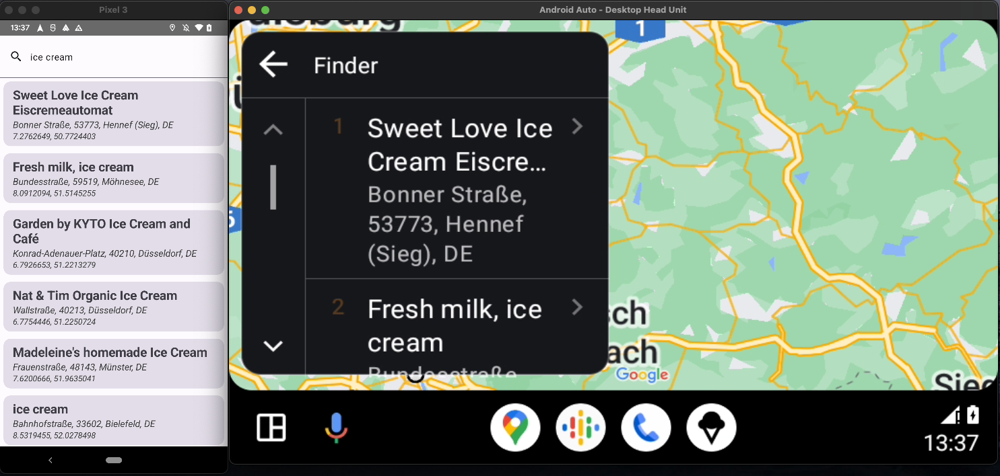
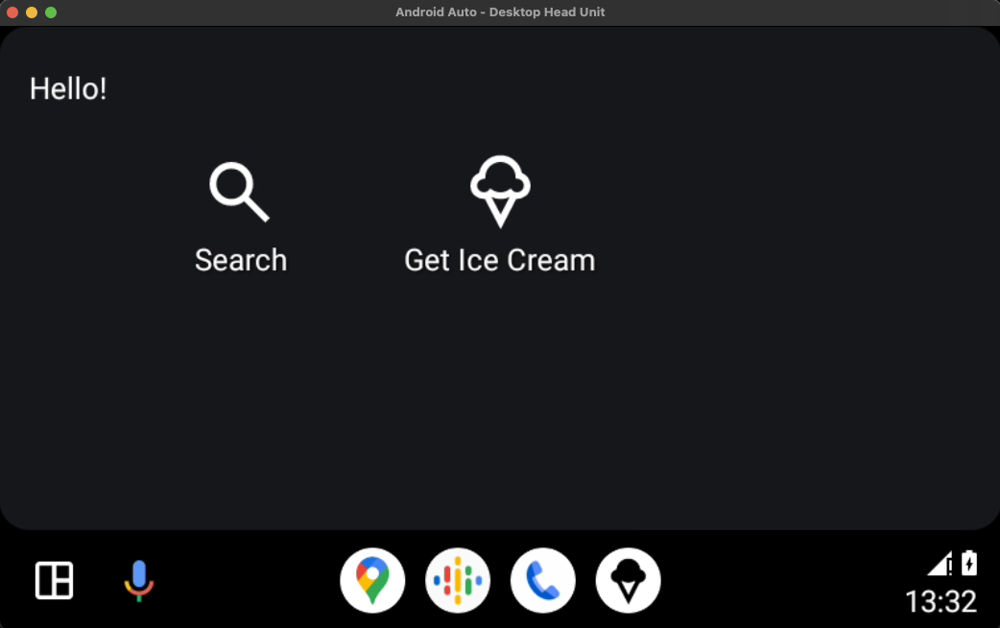
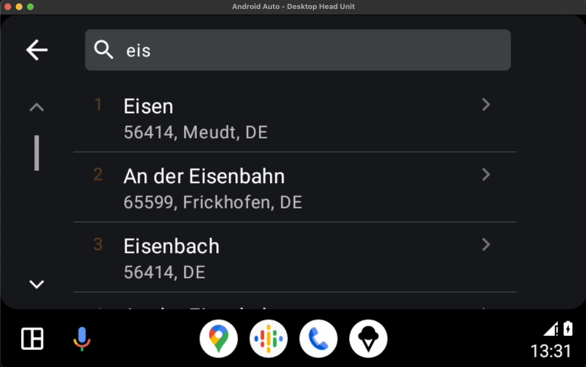

# POI Finder

Simple Android App which uses the [photoon.komoot](https://photon.komoot.io/) API to retrieve and display POIs.
It's a sample to showcase a simple Android Auto Integration via projection. 

For more information see blog post(TODO LINK) related to this project.

## Tech

- Kotlin
- Compose for mobile app
- OkHttp/Retrofit
- Koin
- Play Services Location

## Screenshots

## References

[Google Design for Driving](https://developers.google.com/cars/design/create-apps/apps-for-drivers/templates/overview)

[androidx.car.app](https://developer.android.com/jetpack/androidx/releases/car-app)
## License

[MIT](https://choosealicense.com/licenses/mit/)

